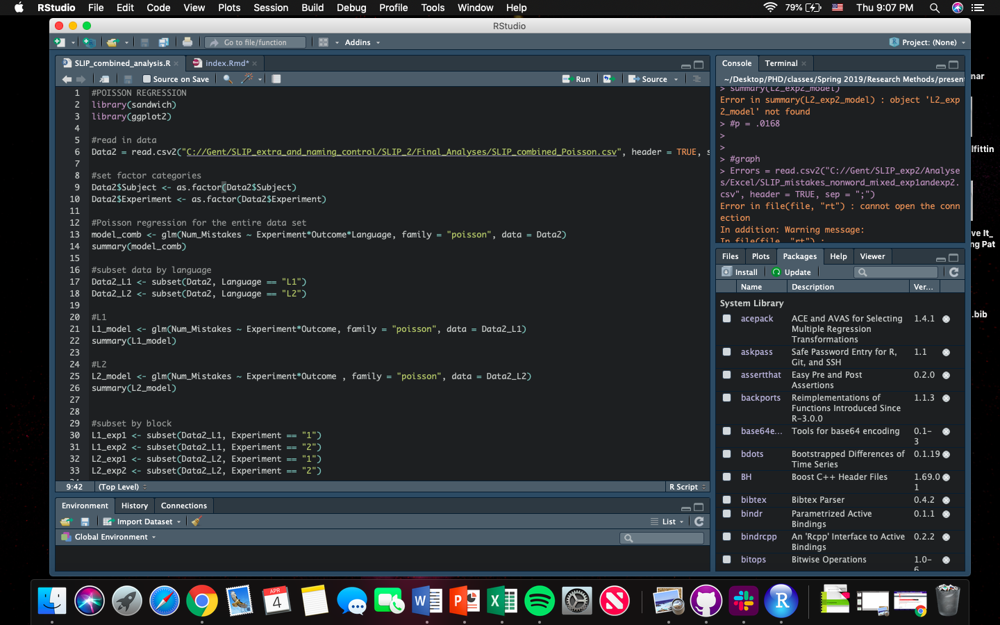
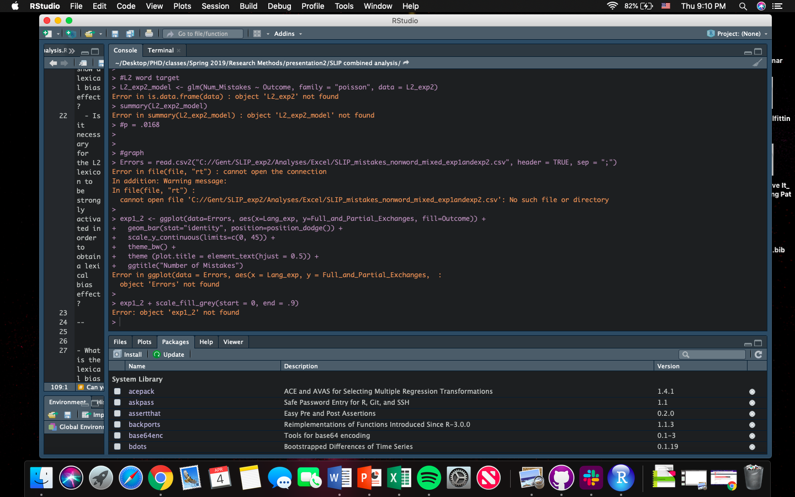
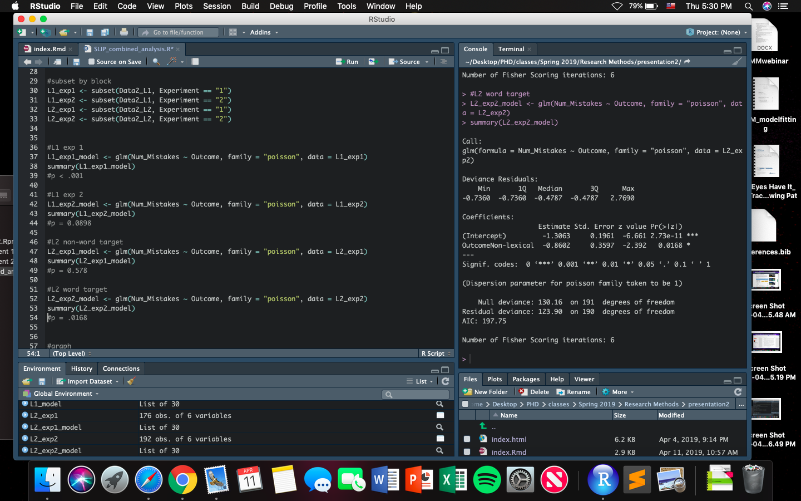
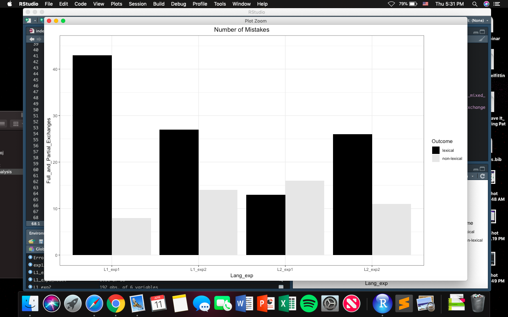
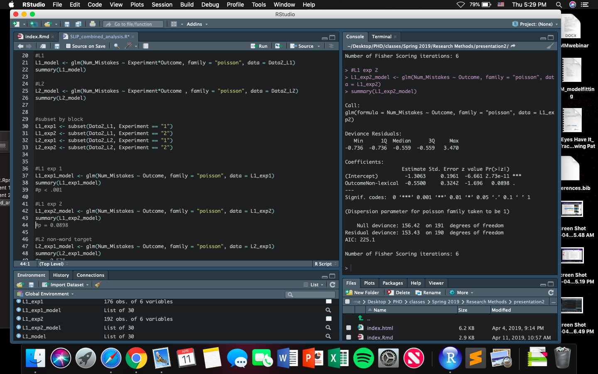
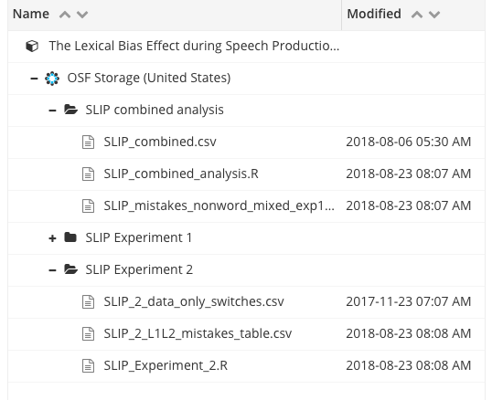

# Goal of the study

--
- Answer the following research questions:

--
  - Do people who are less proficient in their L2 still show a lexical bias effect? 
  - Is it necessary for the L2 lexicon to be strongly activated in order to obtain a lexical bias effect? 

--

- What is the lexical bias effect?
  - The tendency for phonological transposition errors (e.g. "bad salad" instead of "sad ballad") to occur significantly more often if the switch results in exisiting words than non-existing ones.

--

- Can be explained through:
  - the self-monitoring system
  - feedback between the word form and its corresponding phonemes 
  - a combination of the two!

---

# Methdology employed 

- Spoonerisms of Laboratory-Induced Predisposition Task (SLIP Task)
  - Provokes phonological speech errors 
  - Participants are presented with a series of stimulus pairs
  - When they hear a buzz, they are asked to pronounce the last stimulus pair they saw on the screen
  - Before the target pair, stimuli are presented with specific phonological constructions
    - moon - loot; make - lame; move - lose
  - Then the target has the opposite phonological construction
    - leaf - meat

---

# What is publicly available

--

- Data?

--

  - Yes - [link](https://osf.io/egr93/)
  
--

- Code?

--
  
  - Yes - [link](https://osf.io/egr93/)
  
--

- Reproducible document?

--
    - The code is there but its not commented/easy to figure out
    - The manuscript is online
  
--

- Where are the supplementary materials stored? 

  - Folders on OSF
  
---

# Do the supplementary materials include instructions for reproudcing the results?

- There are no explanations in the code as to what to do, the code is just labeled. 

Example: 

--

---

# Is the software used to analyze the data open source?

- Yes, they used R

---

# Can you run the code without errors?

- At first, no. 

--

---

# But with help... 

- It works!

--

---

# Are you able to reproduce the plots and tables?

- YES!

--

---

# Are you able to reproduce the statistical analyses? Are your results the same as the results in the manuscript?

- Yes! (after downloading packages and having to redirect the data file)

---

# What other materials are available? 

- .csv files, .R files, manuscript

--

---

# Using a scale from 1 to 10, give the article an open science score. 

- 7

--
## Justify your evaluation

- Though .csv and R files are online, I had to change a little bit and download packages
- No readme to help you 
- Preprint is online
- Data is available and code used is available, but the code isn't descriptive
  - Which isn't helpful for a novice R user, or someone who would want to reproduce the study
--
- Its a step in the right direction!

---

# Thank you!
